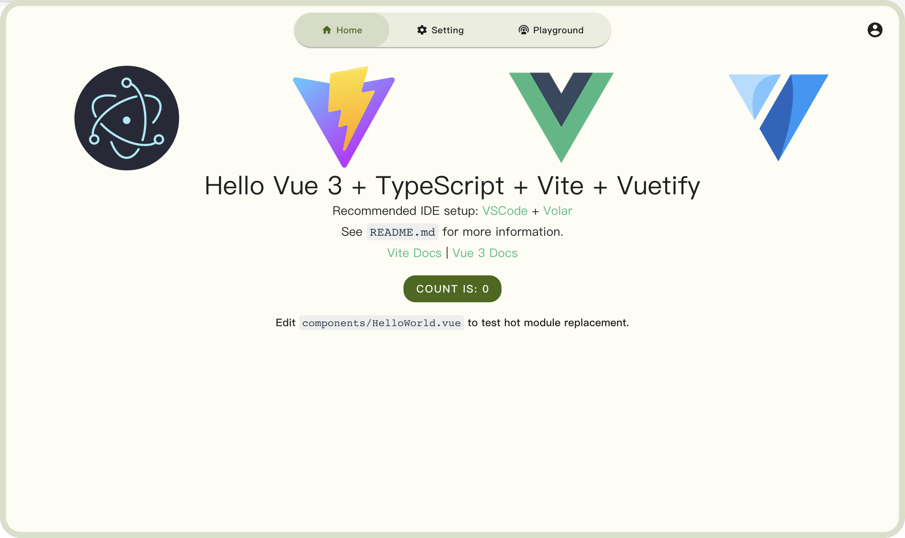

<p align="center">
  
</p>
<h1 align="center">
  vue electron template
</h1>
<p align="center">
    一个集成了<a href="https://next.vuetifyjs.com/" target="_blank"> vuetifyjs</a> 的 electron 桌面客户端简易框架，开箱即用，<a href="https://m3.material.io/" target="_blank"> Material Design 3 (Material You)</a> 风格
</p>

## Introduction

- 基础的应用框架：导航，顶栏，侧边浮动页，设置页
- 集成右键菜单
- 自动生成 md3 主题色（浅色/暗色）

## 截图



## 运行

### 安装依赖

```
npm install

```

### 本地启动开发

```
npm run electron:dev
```

### 打包成客户端

```
npm run electron:build
```

## [License](./LICENSE)
